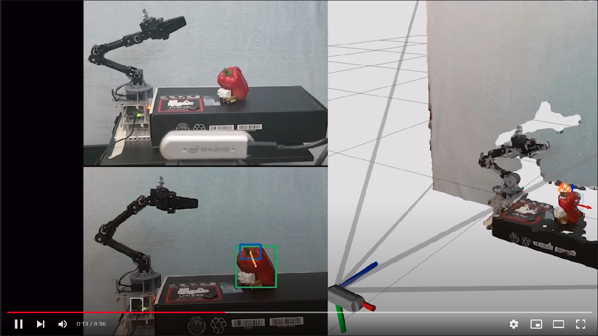
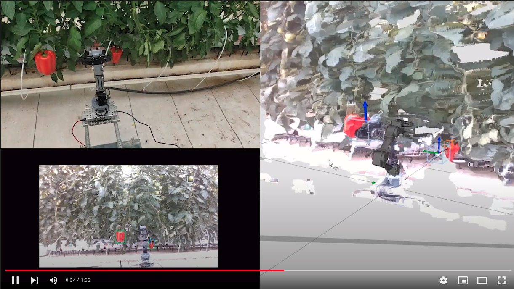

# RGBD Pepper Pose Estimation
> Documentation and code for the "Sweet Pepper Recognition and Peduncle Pose Estimation" thesis  at the M.Sc. Engineering Sciences at Tecnológico de Monterrey

This project contains all the code that was used as part of the 
development. Two Sub-modules are included to separate the development of the neural network model and the ROS nodes.

In brief, the project depicted here, is able detect and recognize sweet 
peppers and their peduncles at their unmodified production environment 
(greenhouse). Using an RGB-D based sensor it is able to estimate their 
3D coordinates and if a peduncle was visible, it is able to estimate 
the peppers rotation. This pose information is then used by a robotic 
arm (ROBOTIS OpenManipulator-X) to make its end-effector reach either 
the peduncles or the peppers.

## Watch it working!

### At a controlled lighting environment
[](https://www.youtube.com/watch?v=nKbfr0XxJEY&ab_channel=lemontyc)

### At an unmodified greenhouse
[](https://youtu.be/6hjs1WwUcts)

## Project Organization

Folder | Description
------- | -----------
dataset | Contains all the tools that were used to create the training dataset. It also contians the dataset labels as they were used during training.
docker | Contains the files necessary to create a docker image with all the necessary libraries to train the Mask R-CNN model.
realsense | Contains test scripts for the RealSense D435i. It also contains a GUI that allows testing the container with .bag files or a live feeed from the D45i camera.
ROS | (Sub-module) Contains scripts that create the nodes that control the robotic arm.
scripts | Contains scripts that create the Docker image and launch it.
tlt | Contains a test version of NVIDA transfer learning toolkit (now TAO) which worked by creating a model.
workspace | (Sub-module) Contains de Mask R-CNN version that was used in this project. 


## Requirements
* Ubuntu 20.04 (older versions might work)
* ROS Noetic [Guide](http://wiki.ros.org/noetic/Installation/Ubuntu)
* Python 3 (Included in Ubuntu 20.04)
* Most recent NVIDIA Driver
* NIDIA docker container toolkit [Guide](https://docs.nvidia.com/datacenter/cloud-native/container-toolkit/install-guide.html)
* Realsense python library [Guide](https://github.com/IntelRealSense/librealsense/tree/master/wrappers/python#installation)
* OpenMaipulator-X ROS Noetic Drivers [Guide](https://emanual.robotis.com/docs/en/platform/openmanipulator_x/quick_start_guide/)
* VS Code with ``Remote - Containers``, ``Jupyter``, ``Python`` extensions.


## Running
1. Download repository to your computer. And run:
    ```sh
    git clone https://github.com/lemontyc/rgbd-pepper-pose-estimation
    cd rgbd-pepper-pose-estimation
    git submodule update --init --recursive
    ```

### Docker Mask R-CNN container
1. Create Docker image, container, and download Mask R-CNN repo. At ``scripts/`` run:

    ```sh
    ./build_run.sh

    # After running the ``build_run.sh`` script for the first time, it is only necessary to run:
    ./start.sh
    ```

2. Download model [here](https://github.com/lemontyc/Mask_RCNN/releases/download/v3.0/pepper20210820T0107.7z) to ``workspace/Mask_RCNN/logs``

3. Download dataset and place images at ``workspace/datasets/620_red_yellow_cart_only`` within ``train/`` and ``val`` directories.  Each of folder should have a ``via_region_data.json`` with the labels for the images in each directory.

4. Attach to the ``m_rcnn:1.0`` container using visual studio ``Remote - Containers Extension``

5. Navigate to the pepper project:
    ```sh
    cd /workspace/Mask_RCNN/samples/pepper
    ```
6. Run model:
    ```sh
    python  inference.py
    ```

### Python OpenCV GUI
> realsense/opencv_GUI/

This interface uses arguments. For help and commands, type:
```python
opencv_gui.py -h
```

1. To use a recording:
    ```sh
    opencv_gui.py -i <path/to/recording.bag>
    ```
2. To use a live sensor, first connect the D435i camera to the computer, then:
    ```sh
    opencv_gui.py 
    ```
>If no recording is provided, the GUI will first try to open a sensor.

### To run ROS nodes
Instructions are available at ROS sub-module repository [here](https://github.com/lemontyc/rgbd-pepper-pose-estimation-ros).


# About

* Main Contributor: **Luis M.**           - [GitHub](https://github.com/lemontyc)

Distributed under the MIT License. See ``LICENSE`` for more information.

This project was developed for the **Sweet Pepper Recognition and Peduncle Pose Estimation** masters thesis of Luis Montoya (@lemontyc) at **Tecnológico de Monterrey** from 2020 to 2021.